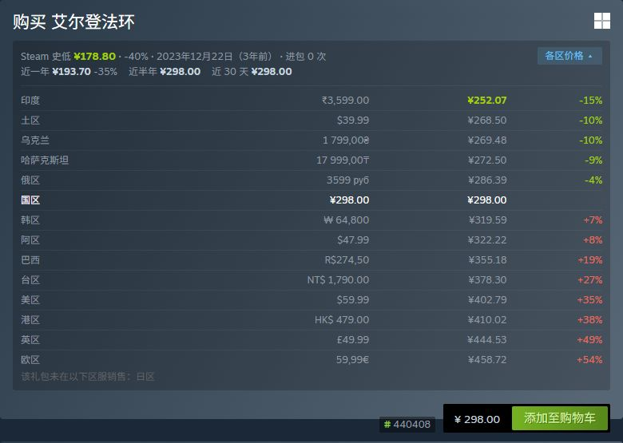
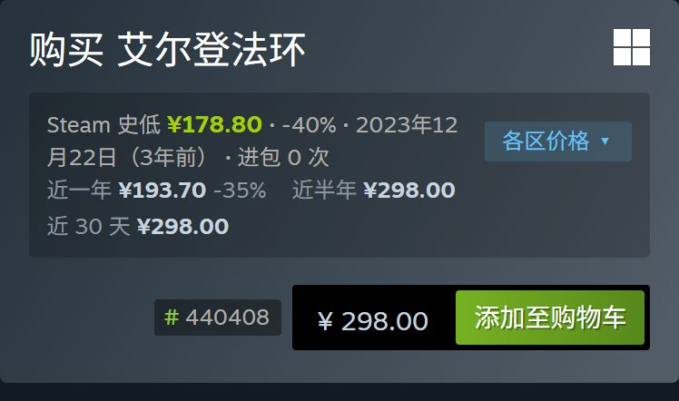
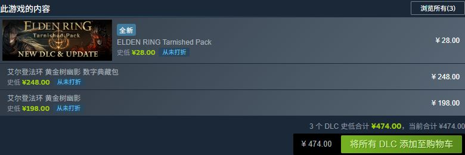
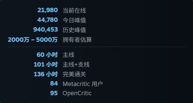
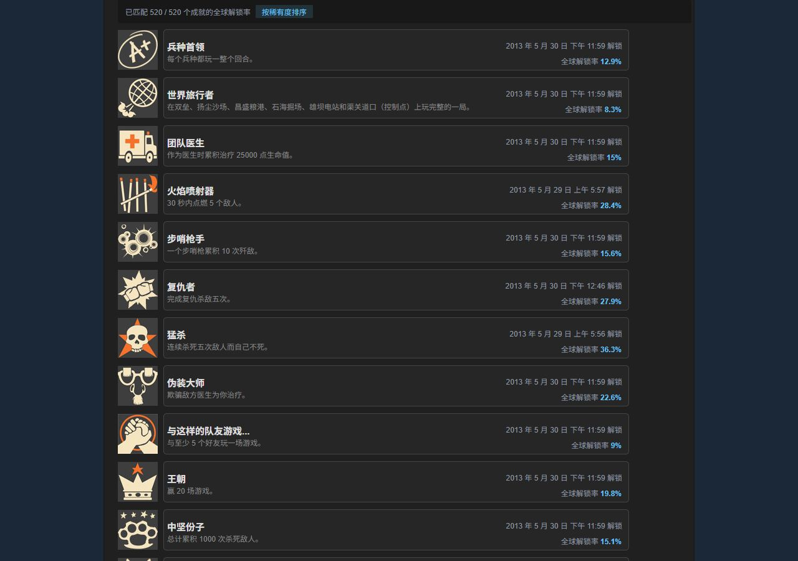

# Steam 商店增强

通过代理工具的 MITM + 脚本，在 Steam 商店与社区页（iOS Steam App 内置浏览器 / Safari 网页版 / 桌面浏览器）注入增强信息，实现 SteamDB、Augmented Steam 浏览器扩展的常用功能。布局参考 SteamDB 官方扩展，尽量使用 Steam 原生样式。

## 效果

| 购买块：史低 + 近期史低 + 各区价格 | 手机（Steam App） |
|---|---|
|  |  |

| DLC 列表史低与合计 | 右侧数据块 |
|---|---|
|  |  |

社区个人成就页：全球解锁率与稀有度排序



## 功能（v0.7.0）

### 商店页（app / sub / bundle）

| 位置 | 功能 | 数据来源 |
|---|---|---|
| 每个购买块 | 该礼包的 Steam 史低（折扣、日期、多久前）、进包次数、从未打折 / 当前即史低标记、全网史低、其他商店当前更低价 | Augmented Steam（ITAD 数据，批量查询） |
| 每个购买块 | 近一年 / 近半年 / 近 30 天 Steam 史低（需开启 `HISTORY` 并填写 `ITAD_KEY`） | ITAD 官方 API（价格变动记录） |
| 每个购买块（展开） | 该礼包在各区服的价格（默认 15 个，可配置），按基准货币换算、排序并标注差价 | Steam `IStoreBrowseService/GetItems`（每区一次批量查询）、Augmented Steam 汇率 |
| 每个购买块 | `# subid` / `# bundleid`，点击跳转 SteamDB | 页面解析 |
| “此游戏的内容”（DLC 列表） | 每个 DLC 的 Steam 史低，以及全部 DLC 的史低合计 / 当前合计 | Augmented Steam（每 50 个 DLC 一次批量查询） |
| 右侧数据块 | 当前在线、今日峰值、历史峰值、拥有者估算、HLTB 时长、Metacritic 用户分、OpenCritic | Steam 官方 API、Augmented Steam、SteamSpy |
| 顶部“社区中心”旁 | SteamDB / PCGamingWiki 按钮（手机端放在“链接”栏） | - |
| 评测摘要 | SteamDB 评分（本地按 SteamDB 公开公式计算） | 页面数据 |
| 年龄验证页 | 自动设置 cookie 并跳过（每个商品只尝试一次） | - |

### 社区页

| 页面 | 功能 | 数据来源 |
|---|---|---|
| 个人成就（`/stats/<游戏>/?tab=achievements`） | 每个成就显示全球解锁率（< 5% 金色、< 1% 红色），可按稀有度排序 | 同源的全局成就统计页 |
| 个人资料 | 右栏增加 SteamDB 计算器链接与 SteamID | 页面数据 |
| 库存 | 选中可交易物品时显示社区市场最低价、成交中位价、24 小时成交量；卡牌 / 补充包显示徽章进度链接 | 同源的社区市场接口 |

## 安装

模块地址（按所用工具选择），安装后开启 MITM 并信任证书：

| 工具 | 地址 | 参数 |
|---|---|---|
| Surge | `https://raw.githubusercontent.com/lonelyman0108/script/refs/heads/master/steam_enhance/surge/steam_enhance.sgmodule` | 模块参数表 |
| Loon | `https://raw.githubusercontent.com/lonelyman0108/script/refs/heads/master/steam_enhance/loon/steam_enhance.plugin` | 插件参数 |
| Stash | `https://raw.githubusercontent.com/lonelyman0108/script/refs/heads/master/steam_enhance/stash/steam_enhance.stoverride` | 编辑覆写中的 `argument` |
| Shadowrocket | `https://raw.githubusercontent.com/lonelyman0108/script/refs/heads/master/steam_enhance/shadowrocket/steam_enhance.module` | 同 Surge；不支持参数的版本使用默认值 |
| Quantumult X | `https://raw.githubusercontent.com/lonelyman0108/script/refs/heads/master/steam_enhance/qx/steam_enhance.conf` | 不支持传参，使用默认值 |

> 验证情况：本地预览（MITM 代理 + 模拟 Surge 运行环境）中全部功能已验证；Surge iOS 真机上已确认各上游接口可达，页面整体效果仍待真机确认。Loon / Stash / Shadowrocket / Quantumult X 按各自官方文档编写，脚本已在 Node 中模拟对应运行环境测试，尚未真机验证。

## 配置参数

| 参数 | 默认 | 说明 |
|---|---|---|
| `COUNTRY` | `auto` | 史低查询与区服对比的基准区服（如 `CN`、`US`），`auto` 跟随商店页当前区服 |
| `CURRENCY` | `auto` | 各区价格换算货币（如 `CNY`、`USD`），`auto` 为基准区服货币 |
| `REGIONS` | `CN/HK/TW/JP/KR/US/GB/DE/RU/UA/KZ/TR/AR/IN/BR` | 参与对比的区服，`/` 分隔，最多 30 个；可选：CN HK TW JP KR SG MY TH ID PH VN IN PK KZ RU UA TR AR BR MX CL CO PE UY CR US CA GB DE FR PL NO CH AU NZ SA AE IL QA KW EG ZA |
| `ITAD_KEY` | `none` | IsThereAnyDeal API Key（免费，[注册应用](https://isthereanydeal.com/apps/my/)后在应用页复制 **API Key**，不是 OAuth Client ID / Secret）；只在代理端使用，放在请求头里发送，不会写入网页 |
| `HISTORY` | `false` | 近一年 / 近半年 / 近 30 天史低；开启后需填写 `ITAD_KEY`，未填写时在第一个购买块提示 |
| `LOWEST` / `REGION_PRICE` / `STATS` / `RATING` / `IDS` / `BUTTONS` / `AGECHECK` / `COMMUNITY` | `true` | 功能开关：史低（含 DLC）/ 各区价格 / 右侧数据块 / SteamDB 评分 / 礼包 ID / 顶部按钮 / 跳过年龄验证 / 社区页增强 |

调试：访问 `https://store.steampowered.com/__steam_enhance/api/ping` 可查看当前生效的参数（不含 Key）。

## 原理

参考 Watt Toolkit（Steam++）的脚本注入实现：

1. `http-response` 在页面 HTML 的 `</body>` 前内联一段前端脚本（Steam CSP 含 `'unsafe-inline'`）
2. 需要代理的数据，前端只请求同源伪路径 `/__steam_enhance/api/*`（CSP `connect-src 'self'` 放行，无 CORS 问题），`http-request` 拦截后由代理端请求 Steam / ITAD / SteamSpy 并缓存，直接返回 JSON
3. Augmented Steam 例外：其服务端 TLS 要求客户端同时支持 P-256 与 P-384 曲线，Surge 的 `$httpClient` 握手失败（`SSLV3_ALERT_HANDSHAKE_FAILURE`），因此由页面直接请求（注入时在 CSP `connect-src` 追加该域名，POST 用 `text/plain` 免预检，结果缓存在 localStorage）
4. 社区页的成就解锁率、市场价格来自 steamcommunity.com 自身接口，页面同源请求即可

不请求 steamdb.info（SteamDB 禁止抓取且会封 IP），只提供跳转链接。

## 已知限制

- MITM 会解密 `steamcommunity.com` 的全部流量（脚本只处理个人资料 / 成就 / 库存页）。若发现 Steam App 的交易确认、聊天等功能异常，可在模块里删掉该主机名，或关闭 `COMMUNITY`。
- 社区市场接口有频率限制，快速连续点选物品时可能提示“暂时无法获取市场价格”。
- 未实现 SteamDB 扩展的“快速出售”：它会直接在市场挂单出售物品，误操作有实际损失，这里只展示价格。

## 本地开发

`dev/` 用 MITM 代理 + Node vm 模拟 Surge 运行环境，直接读取 `surge/steam_enhance.sgmodule`（含参数默认值）与本地脚本，改完脚本刷新页面即生效。

```bash
cd steam_enhance/dev
npm i
npm start -- --chrome        # 启动预览代理 + 独立 Chrome（仅 Steam 域名走代理）
npm run shot -- 1245620      # 商店页截图（也可传 sub/12467、bundle/727）
npm run shot:community       # 社区页（资料 / 成就 / 库存）检查
npm run shot:readme          # 重新生成 README 截图
npm run lan                  # 局域网服务：手机 Surge 从本机安装模块，免推送测试
npm run local -- <目录>      # 生成本地模块（script-path 为相对路径）
# 模块参数可用环境变量覆盖，如 ARG_HISTORY=true ARG_ITAD_KEY=xxx npm start
```
